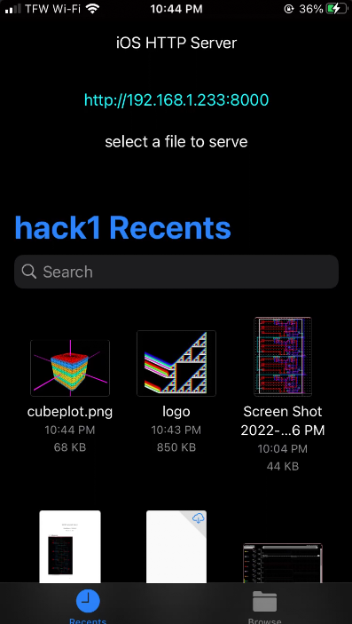
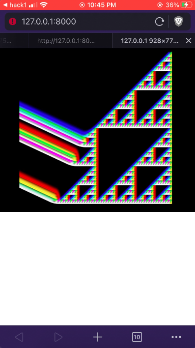

# iOS file server app

### First select a file

### Then click the link to view/download it from your web browser

### You can also vist this link and download the file from any device on your local network

