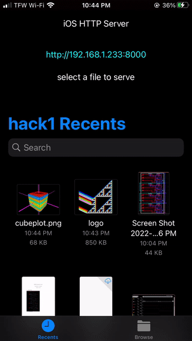

# iOS file server app



### First select a file


### Then click the link to view/download it from your web browser


### You can also vist this link and download the file from any device on your local network

## Whats the point?

I created this app to transfer files from my phone to my laptop.  Once the file is selected I wget it from my laptop.  
Unlike email and cloud file transfer, this method is free and has no file size limitations.
```bash
wget http://192.168.1.233:8000
```

## How does it work

This was implemented using my http server library.  https://github.com/stoned-ape/cpp_http_server


